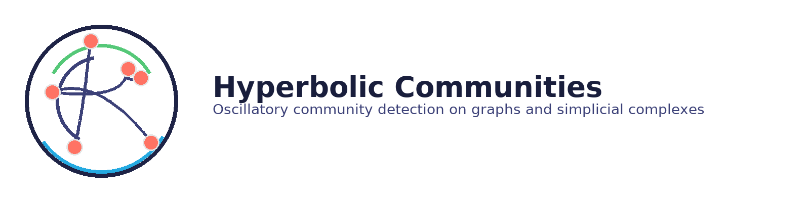

<p align="center">
  
</p>

<h1 align="center">Hyperbolic Communities</h1>
<p align="center">
  Oscillatory community detection using hyperbolic geometric flows on graphs and simplicial complexes.
</p>

<p align="center">
  <a href="https://github.com/Mircus/hyperbolic-communities/actions">
    
  </a>
  <a href="https://opensource.org/licenses/MIT">
    
  </a>
</p>

---

## ✨ What is this?

**Hyperbolic Communities** treats communities as **oscillatory modes** of a network rather than static blocks.  
It implements second‑order (wave‑type) dynamics on graphs and simplicial complexes with:
- energy‑aware leapfrog integration and damping,
- frequency/phase‑based community extraction,
- higher‑order (k‑simplices) support via Hodge Laplacians,
- simple cross‑dimensional coupling operators.

If your data **breathes**—periodic activity, shocks, ringing, or synchrony—this is for you.

---

## 🚀 Quick Start

```bash
# clone your repo
git clone https://github.com/Mircus/hyperbolic-communities.git
cd hyperbolic-communities

# dev install
python -m pip install --upgrade pip
pip install -e .[dev]

# sanity test
pytest -q

# run a tiny demo
python examples/scripts/karate_club_analysis.py
```

---

## 🔧 Minimal Example (Graphs)

```python
import networkx as nx
from hyperbolic_communities import HyperbolicGraphCommunities

G = nx.karate_club_graph()
hgc = HyperbolicGraphCommunities(G, damping=0.15, dt=0.1, m=2)
result = hgc.detect_communities(periods=10.0, method="frequency_phase_hybrid")

print("dominant freqs (per node):", result.get("dominant_freqs"))
print("labels (phase clustering):", result.get("labels"))
```

## 🔺 Simplicial (Higher‑Order) Flows (sketch)

```python
import numpy as np
from hyperbolic_communities.simplicial.simplicial_complex import SimplicialComplex
from hyperbolic_communities.simplicial.hodge_laplacian import build_hodge_laplacians
from hyperbolic_communities.core.hyperbolic_flow import MultiDimHyperbolicFlow
from hyperbolic_communities.simplicial.multi_dimensional_flow import build_coupling_operator

# toy 2-simplex
K = SimplicialComplex([(0,), (1,), (2,), (0,1), (1,2), (0,2), (0,1,2)])
Ls = build_hodge_laplacians(K.simplices)

# simple couplings between dimensions 0,1,2
I_10 = build_coupling_operator(K.simplices, 1, 0)  # nodes -> edges
I_21 = build_coupling_operator(K.simplices, 2, 1)  # edges -> faces

flow = MultiDimHyperbolicFlow(
    Ls=Ls,
    alphas={0:0.1,1:0.12,2:0.15},
    coupling_ops={(1,0): I_10, (2,1): I_21},
    betas={(1,0): 0.3, (2,1): 0.25},
    dt=0.1,
)

# random tiny initialization
c0_prev = {k: __import__("numpy").random.randn(Ls[k].shape[0], 1)*0.05 for k in Ls}
c0_cur  = {k: c0_prev[k].copy() for k in Ls}

t, traj = flow.simulate(c0_prev, c0_cur, T=8.0)
```

---

## 🧠 Features
- Hyperbolic (second‑order) flows with damping
- Hodge Laplacians for k‑simplices (nodes/edges/faces …)
- Frequency + phase community extraction (FFT + spectral clustering)
- Minimal metrics: NMI/ARI, spectral alignment error, PLV
- Lightweight examples & tests; CI scaffold

## 📦 Install
```bash
pip install -e .[dev]
# optional extras:
# pip install -e .[topology]
# pip install -e .[visualization]
# pip install -e .[gpu]
```

## 📚 Documentation
Docs stubs live in `docs/`. You can build them later with Sphinx:
```bash
pip install -e .[dev]
(cd docs && sphinx-build -b html . _build)
```

## 🤝 Contributing
PRs welcome! Please run tests and linters before pushing:
```bash
pytest -q
black . && flake8
```

## 📝 Citation
If you use this library, please cite the companion paper / repo.
```bibtex
@software{hyperbolic_communities_2025,
  title = {Hyperbolic Communities},
  author = {Mircus et al.},
  year = {2025},
  url = {https://github.com/Mircus/hyperbolic-communities}
}
```

## 📄 License
MIT © Hyperbolic Communities Developers
